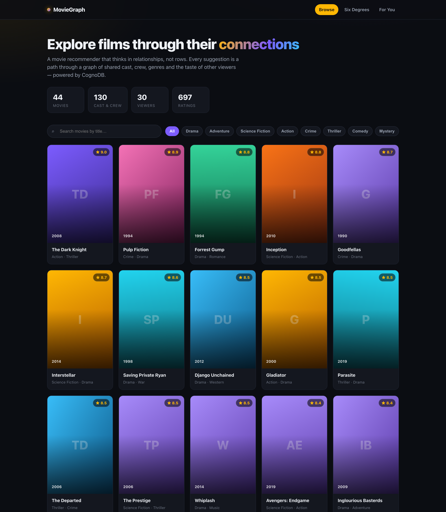

# 🎬 MovieGraph

**A graph-native movie recommendation explorer, backed by [CognoDB](https://console.cognodb.com).**

MovieGraph lets anyone explore films the way our intuition actually works — through
_connections_. Not "show me action movies sorted by year," but "why should I watch this,
who connects these two actors, and what did people with my taste love?" Those questions are
about **paths and neighbourhoods in a network**, which is exactly what a graph database is
built to answer.

> Browse the catalogue → open a film → get recommendations that are literally traversals of
> the graph → trace the "six degrees" chain between any two actors → get personalised picks
> from viewers who share your taste.

---

## Table of contents

- [Why a graph database?](#why-a-graph-database)
- [The data model](#the-data-model)
- [The queries that earn the graph](#the-queries-that-earn-the-graph)
- [Architecture](#architecture)
- [Setup & run](#setup--run)
  - [1. Create a CognoDB instance](#1-create-a-cognodb-instance)
  - [2. Configure secrets](#2-configure-secrets)
  - [3. Seed the graph](#3-seed-the-graph)
  - [4. Run the backend](#4-run-the-backend)
  - [5. Run the frontend](#5-run-the-frontend)
- [Deployment](#deployment)
- [Screenshots](#screenshots)
- [Project structure](#project-structure)

---

## Why a graph database?

The core features of this app are all **relationship questions**, and each one gets harder in
a relational schema in a way that maps directly to how graphs work:

| Feature | As a graph query | As SQL |
| --- | --- | --- |
| **More like this** | One traversal out of a movie through shared genres, keywords, cast and director, summing a weight per hop. | Several `UNION`ed self-joins across `movie_genre`, `movie_keyword`, `role`, plus a manual `GROUP BY` to re-aggregate the weighted overlap. |
| **Fans also liked** | `Movie <-[:RATED]- User -[:RATED]-> Movie`, one pattern. | A self-join of a multi-million-row ratings table against itself, filtered on both ends — the classic expensive collaborative-filtering join. |
| **Six degrees of separation** | `shortestPath((a)-[:ACTED_IN*]-(b))` — a single built-in. | A recursive CTE of **unbounded** join depth. There is no fixed number of joins that answers "how far apart are these two actors," because you don't know the answer's length in advance. |
| **Recommend for you** | Hop from a user to like-minded peers to the films they loved. | A three-way self-join across users, ratings and movies with de-duplication against the user's own history. |

The through-line: **relational databases store relationships as foreign keys and re-discover
them at query time with joins.** The cost of a join grows with the data on both sides, and
_variable-length_ relationships (six degrees) can't be expressed with a fixed query at all. A
graph database stores each relationship as a first-class, directly-traversable pointer, so
"walk from here to there" is O(the path), not O(the tables). When the interesting questions
are about the shape of the network, that difference is the whole ballgame.

Our dataset is intentionally **densely connected** (actors and directors recur across films —
the Nolan/DiCaprio/Scorsese/Tarantino clusters overlap heavily) so these traversals return
genuinely useful, non-obvious results rather than trivial one-hop matches.

---

## The data model

```mermaid
graph LR
  P((Person)) -->|ACTED_IN<br/>{character, order}| M((Movie))
  P -->|DIRECTED| M
  M -->|IN_GENRE| G((Genre))
  M -->|HAS_KEYWORD| K((Keyword))
  U((User)) -->|RATED<br/>{stars}| M
```

**Nodes**

| Label | Key properties |
| --- | --- |
| `Movie` | `id`, `title`, `year`, `runtime`, `rating`, `tagline`, `plot` |
| `Person` | `name` (actors and directors share the label — many people are both) |
| `Genre` | `name` |
| `Keyword` | `name` (theme tags: `heist`, `survival`, `multiverse`, …) |
| `User` | `id`, `name`, `taste` (a taste-profile label used to cluster ratings) |

**Relationships**

| Type | From → To | Properties |
| --- | --- | --- |
| `ACTED_IN` | `Person` → `Movie` | `character`, `order` |
| `DIRECTED` | `Person` → `Movie` | — |
| `IN_GENRE` | `Movie` → `Genre` | — |
| `HAS_KEYWORD` | `Movie` → `Keyword` | — |
| `RATED` | `User` → `Movie` | `stars` (1–5) |

Uniqueness constraints on `Movie.id`, `Person.name`, `Genre.name`, `Keyword.name` and
`User.id` keep the graph clean and double as lookup indexes. The seed uses `MERGE`
throughout, so re-running never duplicates nodes or edges.

---

## The queries that earn the graph

All Cypher lives in [`backend/app/queries.py`](backend/app/queries.py), fully parameterised —
**no string-concatenated Cypher anywhere**; every value is passed through the driver's
parameter map.

### 1. Multi-hop content recommendation — _More like this_

A 2-hop traversal that fans out from a movie through four kinds of shared attribute, weighting
each and summing per neighbour:

```cypher
MATCH (m:Movie {id: $id})
CALL {
    WITH m MATCH (m)-[:IN_GENRE]->(:Genre)<-[:IN_GENRE]-(rec:Movie)     RETURN rec, 2 AS w, 'genre' AS via
  UNION
    WITH m MATCH (m)-[:HAS_KEYWORD]->(:Keyword)<-[:HAS_KEYWORD]-(rec:Movie) RETURN rec, 4 AS w, 'keyword' AS via
  UNION
    WITH m MATCH (m)<-[:ACTED_IN]-(:Person)-[:ACTED_IN]->(rec:Movie)    RETURN rec, 3 AS w, 'cast' AS via
  UNION
    WITH m MATCH (m)<-[:DIRECTED]-(:Person)-[:DIRECTED]->(rec:Movie)    RETURN rec, 5 AS w, 'director' AS via
}
WITH m, rec, sum(w) AS score, collect(DISTINCT via) AS reasons
WHERE rec.id <> m.id
RETURN rec.id AS id, rec.title AS title, score, reasons
ORDER BY score DESC LIMIT $limit
```

The UI shows the `reasons` as tags ("shared cast", "director", "keyword") so a recommendation
is **explainable** — you can see _why_ the graph suggested it.

### 2. Collaborative filtering — _Fans also liked_

The textbook bipartite traversal SQL dreads:

```cypher
MATCH (m:Movie {id: $id})<-[r1:RATED]-(u:User)-[r2:RATED]->(rec:Movie)
WHERE r1.stars >= 4 AND r2.stars >= 4 AND rec.id <> m.id
RETURN rec, count(DISTINCT u) AS fans, round(avg(r2.stars), 2) AS avg_stars
ORDER BY fans DESC LIMIT $limit
```

### 3. Variable-length shortest path — _Six degrees_

The showcase graph primitive, with no clean relational equivalent:

```cypher
MATCH (a:Person {name: $a}), (b:Person {name: $b})
MATCH p = shortestPath((a)-[:ACTED_IN*..12]-(b))
RETURN [n IN nodes(p) | ...] AS chain, length(p) / 2 AS degrees
```

### 4. Personalised recommendations — _For you_

Hop from a user to peers who share their high ratings, then to the films those peers loved
that the user hasn't seen. See `recommend_for_user` in `queries.py`.

> Run [`backend/smoke_test.py`](backend/smoke_test.py) after seeding to execute **every** query
> against your live instance and confirm the whole data layer works.

---

## Architecture

```
React + Vite (TypeScript)  ──HTTP/JSON──▶  FastAPI  ──Bolt (openCypher)──▶  CognoDB
   pages / components                       routers → queries → neo4j driver
```

- **Backend** — FastAPI. Thin routers validate inputs (types + bounds) and delegate to a
  single `queries` module. A shared `neo4j` driver (its own connection pool) talks Bolt to
  CognoDB. A typed `DatabaseUnavailable` error is mapped globally to HTTP **503**, so an
  unreachable database becomes a clean, friendly response instead of a stack trace.
- **Frontend** — React + Vite. A small `useAsync` hook standardises loading / empty / error
  states everywhere; a global health banner detects an offline or unconfigured database.
- **Config** — every secret (URI, password) is read from environment variables. `.env` is
  git-ignored; only `.env.example` is committed.

---

## Setup & run

**Prerequisites:** Python 3.10+ and Node 18+.

### 1. Create a CognoDB instance

1. Sign up at **https://console.cognodb.com/signup** (free tier, no credit card).
2. Create a free **c0** instance and pick a region — it provisions in under a minute.
3. Copy your connection **URI** (`bolt+s://<instance-id>.databases.cognodb.cloud`) and the
   generated **password** for user `cognodb`. **The password is shown only once — save it now.**

### 2. Configure secrets

```bash
cp .env.example .env          # in the repo root
# edit .env and paste your NEO4J_URI and NEO4J_PASSWORD
```

The backend loads `.env` automatically (via `python-dotenv`). Nothing secret is committed.

### 3. Seed the graph

```bash
cd backend
python -m venv .venv && source .venv/bin/activate
pip install -r requirements.txt
python -m seed.seed          # loads 44 movies + generates ~30 users & their ratings
python smoke_test.py         # optional: run every query against your instance
```

The seed is **idempotent** (`MERGE`-based) — safe to re-run.

### 4. Run the backend

```bash
# from backend/, with the venv active
uvicorn app.main:app --reload --port 8000
# API now at http://localhost:8000  (health check: /api/health)
```

### 5. Run the frontend

```bash
cd frontend
npm install
npm run dev                  # http://localhost:5173  (proxies /api to :8000)
```

Open **http://localhost:5173** and explore.

---

## Deployment

**→ Full step-by-step guide: [`docs/DEPLOY.md`](docs/DEPLOY.md)** (Render + Vercel, with the
CORS/`VITE_API_BASE` ordering and troubleshooting).

In short — the app is two independently-hostable pieces; any free tier works:

- **Backend (FastAPI):** deploy `backend/` to Render / Railway / Fly.io. Start command:
  `uvicorn app.main:app --host 0.0.0.0 --port $PORT`. Set `NEO4J_URI`, `NEO4J_PASSWORD` and
  `CORS_ORIGINS` (your frontend URL) as environment variables in the host's dashboard.
- **Frontend (static):** deploy `frontend/` to Vercel / Netlify / Cloudflare Pages. Build
  command `npm run build`, output dir `dist`, and set `VITE_API_BASE` to your backend URL.

> **Keep your CognoDB instance running** until the review is complete, per the assignment.

---

## Screenshots

**Browse** — search, genre filters and the full catalogue, with live graph stats up top.



**Movie detail** — cast, plus two graph-powered recommendation rows: _More like this_
(content-based, with explainable "genre / shared cast / director" reason tags) and _Fans also
liked_ (collaborative filtering).


**Six degrees** — the shortest chain of shared films between any two actors, a variable-length
`shortestPath` traversal.


**For you** — personalised recommendations for a viewer, drawn from like-minded viewers'
ratings.


---

## Project structure

```
cognodb-movie-graph/
├── README.md
├── .env.example                 # template; real .env is git-ignored
├── backend/
│   ├── requirements.txt
│   ├── smoke_test.py            # runs every query against the live DB
│   ├── app/
│   │   ├── config.py            # env-var settings
│   │   ├── db.py                # Bolt driver + graceful error handling
│   │   ├── queries.py           # all parameterised Cypher
│   │   ├── main.py              # FastAPI app + 503 handler
│   │   └── routers/api.py       # HTTP routes
│   └── seed/
│       ├── seed.py              # idempotent loader + rating generator
│       └── data/movies.json     # curated, densely-connected film dataset
└── frontend/
    ├── src/
    │   ├── api.ts               # typed API client
    │   ├── useAsync.ts          # loading/error hook
    │   ├── App.tsx              # routing + health banner
    │   ├── components/          # MovieCard, states, Poster
    │   └── pages/               # Home, MovieDetail, SixDegrees, ForYou
    └── ...
```

---

Built as a take-home assignment demonstrating graph data modelling on CognoDB
(openCypher over Bolt, via the official Neo4j driver).
