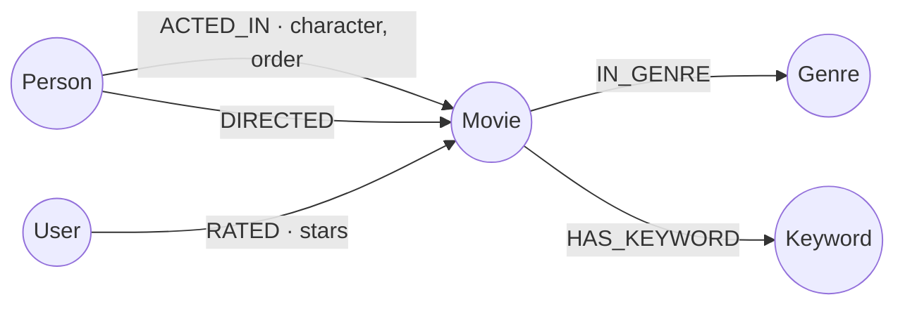
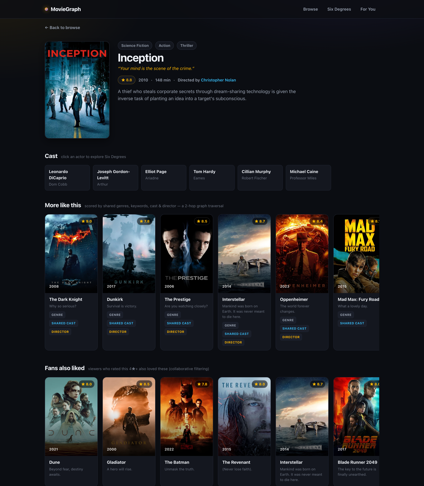
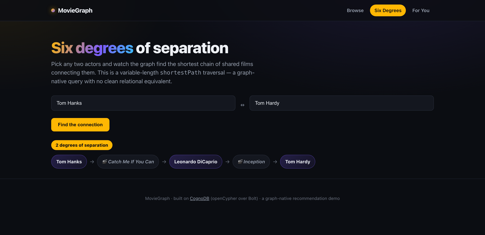
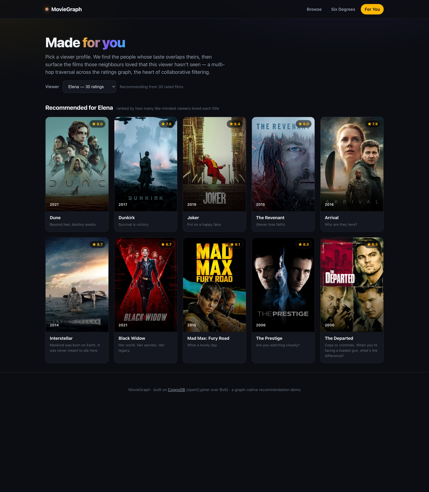

# 🎬 MovieGraph

A little movie explorer that recommends films the way your brain actually does —
by connection. *"What's this like?"*, *"who links these two actors?"*, *"what did people with
my taste love?"* Those are questions about a network, so the whole thing runs on a graph
database ([CognoDB](https://console.cognodb.com), openCypher over Bolt).

Browse films → open one → get recommendations that are literally graph traversals → trace the
"six degrees" between any two actors → get picks tuned to a viewer's taste.


<sub>A quick walkthrough (silent). Full-quality MP4: [`docs/demo/demo.mp4`](docs/demo/demo.mp4).</sub>

## Why a graph database?

Everything interesting here is a *relationship* question, and each one is a natural fit for a
graph and an awkward one for SQL:

- **More like this** — one hop out through shared genres, keywords, cast and director, scored by
  overlap. In SQL that's several UNION'd self-joins across junction tables and a manual re-aggregate.
- **Fans also liked** — `Movie ← RATED ← User → RATED → Movie`, one line. In SQL it's the ratings
  table joined against itself, the classic expensive collaborative-filtering join.
- **Six degrees** — `shortestPath` between two actors. There's no fixed SQL for this: you don't
  know how many joins you need until you've found the answer. It's a recursive CTE of unknown depth;
  in Cypher it's a built-in.

The point: relational stores keep relationships as foreign keys and rebuild them with joins at
query time. A graph stores each relationship as a pointer you just follow. When your questions are
about the *shape* of the network, that's the whole game. (The seed data is deliberately dense —
the Nolan / DiCaprio / Scorsese / Tarantino circles overlap a lot — so these traversals surface
real, non-obvious results.)

## The graph



| Node | Notable properties |
| --- | --- |
| `Movie` | `title`, `year`, `runtime`, `rating`, `tagline`, `plot`, `poster_url` |
| `Person` | `name` — actors and directors share the label; plenty are both |
| `Genre` / `Keyword` | `name` |
| `User` | `name`, `taste` (a profile that clusters their ratings) |

Relationships: `ACTED_IN {character, order}`, `DIRECTED`, `IN_GENRE`, `HAS_KEYWORD`,
`RATED {stars}`. Uniqueness constraints double as indexes; the seed uses `MERGE`, so re-running
never duplicates anything.

## The queries

All Cypher lives in [`backend/app/queries.py`](backend/app/queries.py) and is **fully
parameterised** — values always go through the driver, never string-concatenated. The four that
carry the app:

1. **`more_like_this`** — the 2-hop weighted content recommender. The UI shows *why* each pick
   surfaced (genre / shared cast / director tags).
2. **`fans_also_liked`** — collaborative filtering over the ratings graph.
3. **`shortest_path_between_actors`** — the Six Degrees traversal.
4. **`recommend_for_user`** — personalised picks via like-minded viewers.

Run [`backend/smoke_test.py`](backend/smoke_test.py) after seeding to fire every query at your
live instance and confirm the data layer is healthy (14 checks).

## Tests

Two levels. **Unit tests** run offline (the driver and queries are mocked) and cover config,
error translation, query post-processing, and the HTTP layer (validation, 404, and the graceful
503). **The smoke test** is the integration check — it needs a live instance and verifies the
Cypher itself.

```bash
# unit tests — no database needed
cd backend && pip install -r requirements-dev.txt && python -m pytest   # 18 tests
cd frontend && npm test                                                 # 6 tests

# integration — against your seeded CognoDB
cd backend && python smoke_test.py                                      # 14 checks
```

## How it fits together

```
React + Vite (TS)  ──HTTP/JSON──▶  FastAPI  ──Bolt/openCypher──▶  CognoDB
   pages/components                 routers → queries → neo4j driver
```

The backend is thin and layered: `config` (env only) → `db` (one shared driver, typed errors) →
`queries` (all Cypher) → `routers` (validate & shape). If CognoDB is unreachable it becomes a
clean **503** with a friendly message, not a stack trace — and the frontend mirrors that with
loading / empty / error states and a health banner. Secrets are read from the environment and
never committed.

## Run it locally

**You'll need** Python 3.10+ and Node 18+.

**1. Create a CognoDB instance** at [console.cognodb.com/signup](https://console.cognodb.com/signup)
(free, no card). Make a free **c0** instance and copy the `bolt+s://` URI and the `cognodb`
password — the password is shown only once.

**2. Add your secrets**

```bash
cp .env.example .env      # then fill in NEO4J_URI and NEO4J_PASSWORD
```

**3. Seed the graph**

```bash
cd backend
python -m venv .venv && source .venv/bin/activate
pip install -r requirements.txt
python -m seed.seed        # 44 films + ~30 viewers and their ratings
python smoke_test.py       # optional: check every query against your instance
```

Posters are optional: add a free `TMDB_API_KEY` to `.env`, then
`python -m seed.enrich_posters && python -m seed.seed` to fetch real poster art. Without it,
cards fall back to clean generated gradients.

**4. Start both servers**

```bash
# backend (in backend/, venv active)
uvicorn app.main:app --reload --port 8000

# frontend (in frontend/)
npm install && npm run dev
```

Open **http://localhost:5173**.

## Deploy

Two independently-hostable pieces — backend on Render, frontend on Vercel, any free tier works.
Step-by-step (with the CORS ordering gotcha and troubleshooting): **[`docs/DEPLOY.md`](docs/DEPLOY.md)**.

## A look around

| Movie detail + recommendations | Six degrees | Made for you |
| --- | --- | --- |
|  |  |  |

## Layout

```
backend/
  app/        config · db · queries · routers · main
  seed/       seed.py · enrich_posters.py · data/movies.json
  tests/      unit tests (pytest) · smoke_test.py (live integration)
frontend/
  src/        api.ts · useAsync.ts · pages/ · components/ · *.test.tsx
docs/         DEPLOY.md · SUBMISSION_CHECKLIST.md · screenshots/
```

---

Poster images and metadata from [The Movie Database (TMDB)](https://www.themoviedb.org) — this
product uses the TMDB API but isn't endorsed or certified by TMDB.
